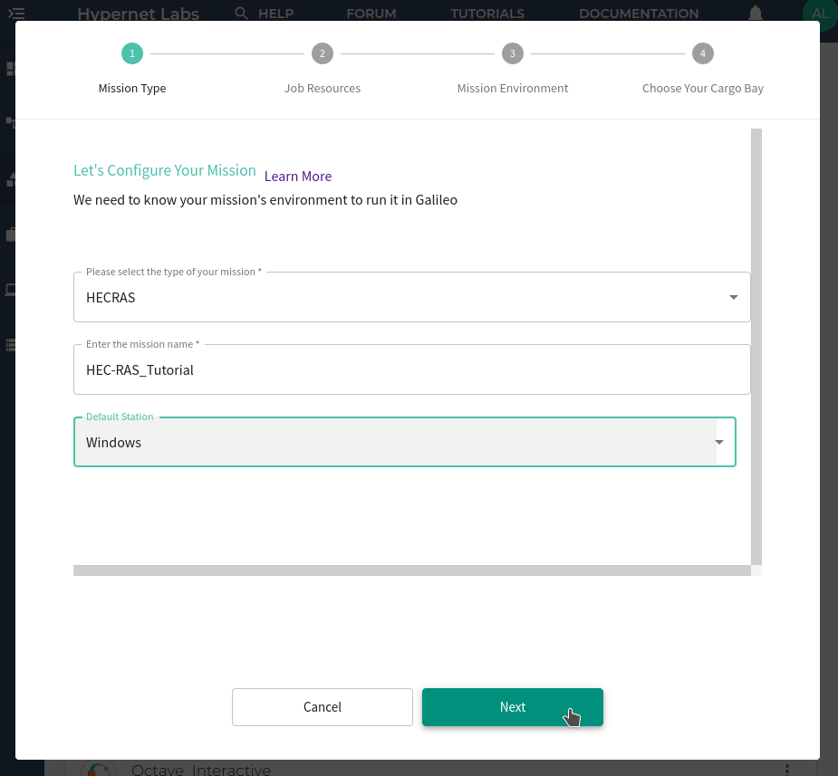
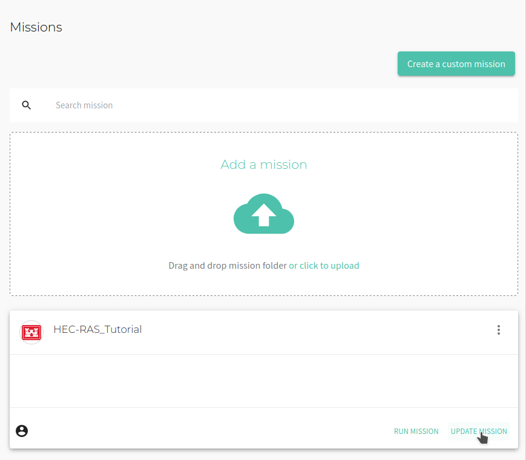

# Tutorial: Running HEC-RAS in Galileo

### Gettting started with HEC-RAS in Galileo

To get started with Galileo, [log into your account](http://galileo.hypernetlabs.io/) using Firefox or Chrome and download our HEC-RAS example [from GitHub](https://github.com/GoHypernet/Galileo-examples/archive/HEC-RAS.zip).

### Let's take a look at our files

HEC-RAS is software that models the hydraulics of water flow through natural rivers and other channels. The HEC-RAS example in this tutorial is the standard 2D Muncie example that comes with the examples package of the HEC-RAS simulator.

### Understanding the user interface and creating a Mission

When you log into Galileo, the first thing you’ll see is your Dashboard:

To run the HEC-RAS example, start by navigating to the Missions tab using the side menu. On the Missions tab, click the **Creat a custom mission** button.

Configure the mission by selecting the mission type. Choose **HECRAS**.

Next, give the mission a name and assign it to a default station to use. This tutorial will use the **Windows** station. Click **Next**.

Set the default amount of computational resources for the mission. Choose the CPU resources and memory resources. Click **Next**.

Create the mission environment by choosing a RAS version. You can optionally connect the Mission to your Network File System. You can also choose which plan to run on your HEC-RAS project. Click **Next**.

Finally, select the Cargo Bay you will use for this Mission. You can choose from the default Hypernet storage or an external storage provider. Galileo works seemlessly with cloud storage platforms such as Dropbox and Storj. Find out more about using these platforms [here](https://galileo-sdk.readthedocs.io/en/latest/cargobays.html). Click **Submit**.

The Mission has now been created!

### Running a job and collecting results

You will now see the new Mission reflected in the Mission tab. Click **Update Mission** to add and edit the Mission's files.

Upload the Muncie example folder by clicking the **Upload Folder** button. You will see the files in the Mission interface.

Now we are ready to run a job using the Mission. Click the **Run** button in the upper right corner of the Mission tab. You will see a "Mission run successfully!" message. At the bottom of the Mission tab, you can track the progress of the job.

Once the computation is complete, the job will shut down and collect the results. Once the job progress reads "Completed", you can download any files generated by the simulation by opening the three-dot menu again and clicking **Download**.

### Contact us

We hope this tutorial was helpful. Please let us know if you have any questions or any problems using Galileo. Your feedback is extremely important to us. Contact us anytime at [matthew@hypernetlabs.io](matthew@hypernetlabs.io) or [alexander@hypernetlabs.io](alexander@hypernetlabs.io).