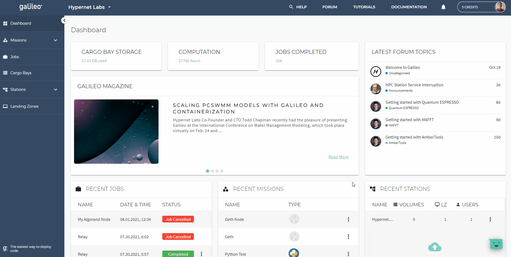

# Algorand Relay Nodes in Galileo

Galileo makes launching and maintaining your Algorand relay node easy. Your node is fully non-custodial and comes with an integrated 
development environment which includes python, go, and nodejs runtimes for dApp development. Your personal RPC API is hosted and protected 
by the [Cloudflare](https://www.cloudflare.com/products/tunnel/) edge network so you don't have to worry about port firewall configurations.
Check out the information below to learn more about the Algorand Mission framework in Galileo. 

### Launching an Algorand Node Session

1. Navigate to the Missions tab on the left-hand side of the application and click the "Your Missions" sub-tab. 
2. Click the "Create a Mission" button on the upper right-hand side of the Missions main page. 
3. Choose the Algorand Mission type, give the Mission a name, and then click "Create & Run Mission". 
4. Select the Hypernet - Algorand Station, then wait for your new Mission job instance to start. 
5. Once your job says "Job in Progress", request your automatically generated job password and click "Go to Tunnel URL". 
6. Enter your username and paste your password into the login form. 
7. You are now logged into your Algorand Relay Node session. 

**NOTE**: It can sometimes take up to 5 minutes before the URL for your tunnel is active in the Cloudflare DNS. So if your browser cannot
 connect immediately, try again in a couple of minutes. 

### Starting the Algorand Relay Node

Once you have logged into your Algorand Relay Node Session, you can start your relay node by clicking the 
"Start Relay Node" button under the "Quick Access" title. Your relay node will likely take a few days to completely sync the full
state of the chain. This lengthy process is necessary to ensure the validity of all blocks downloaded from the peer network.

You can check the progress of the synchronization process by clicking the "Get Node Status" button. Once the line that reads "Sync Time:" 
reports 0s your node is completely synced to the Algorand network.

Occasionally, there are protocol and node software upgrades that require updating your node binaries. Simply click the "Upgrade Node" button
to check if there are any updates available. They will be downloaded and applied automatically.

### Connecting to Your Algorand Relay RPC Endpoint

When your Relay node is fully synchronized, you can use its RPC interface to interact with the Algorand network programmatically. The URL for your
RPC endpoint can be obtained by right-clicking the link named "RPC API" under "Your API Endpoints". This URL along with the 
[algod.token](https://developer.algorand.org/docs/reference/sdks/#security-token) generated in the `data/` directory can be used to connect 
to your Algorand node through one of Algorand's official [SDKs](https://developer.algorand.org/docs/reference/sdks/). To download the algod.token 
file, open the workspace explorer widget in the upper left corner, open the `data/` directory, then right-click the file named algod.token and 
select "download" (this will save it to your local desktop).

### Logging Out and Changing Your Session Password

Galileo will set a secure random password for your job session at runtime. This password is stored in an encrypted format by Galileo until requested
by an authenticated user. However, the user can change their job password by clicking the key icon in the Galileo IDE Dashboard, confirming their
old password, then entering a new one. **WARNING**: If you change your password, Hypernet Labs cannot recover it for you. Additionally, a user can log out of their current session from this page as well. 

### Fast Relay Node Synchronization from Storj DCS with RClone (Advanced Users)

Hypernet Labs maintains weekly snapshots of the Algorand Archival Chain in [Storj DCS](https://storj.io/signup/?partner=hypernet). An integrated
RClone widget is included in the Galileo IDE of your job session with a pre-registered access grant (read permission only) to the snapshot.
Synchronizing your job session from the remote snapshot will allow you to get your relay node up and running in hours rather than days. 

1. Open the Storj DCS widget and ensure you are pointing at the "Algorand Fast Sync" RClone remote. 
2. Select "algorandsnapshot" from the bucket list. 
3. Choose the "SYNC" operation from the actions list.
4. In the remote storage path, choose the root path of the bucket. 
5. In the job session path, choose `/home/galileo/data/mainnet-v1.0`. 
6. Click "sync remote storage to job session".

The download time will be around a couple of hours depending on your network conditions and the current size of the archival blockchain. Once it has finished downloading, 
start your relay node by clicking the "Start Relay Node button and wait for the node to catch up to the current block (usually <1 hour).

**NOTE**: RClone's sync function will force the target directory to match the data source. If you sync to a target folder containing previous chain data, it will be overwritten. 

