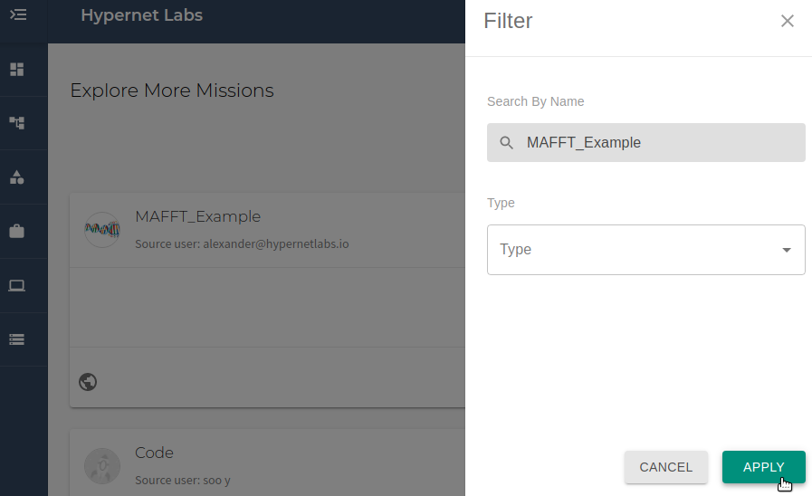
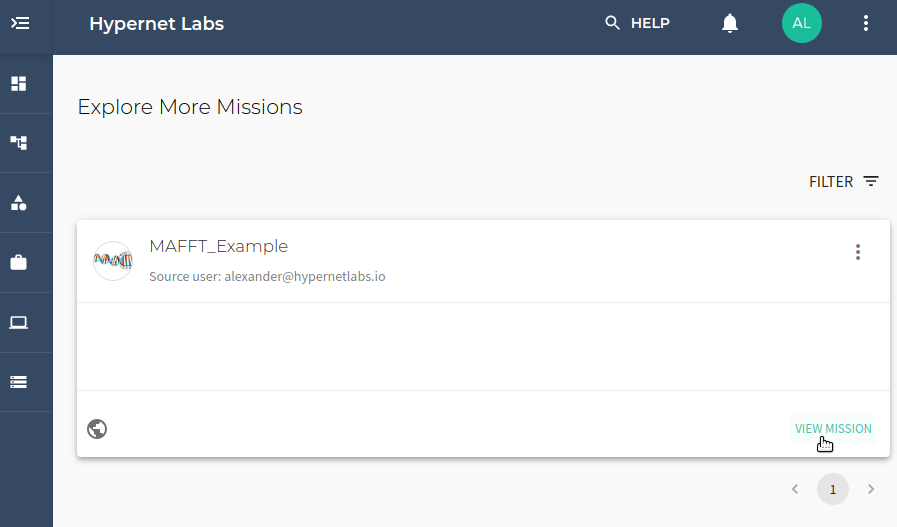
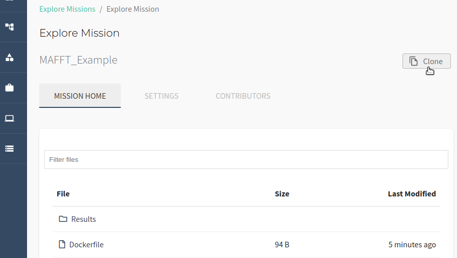
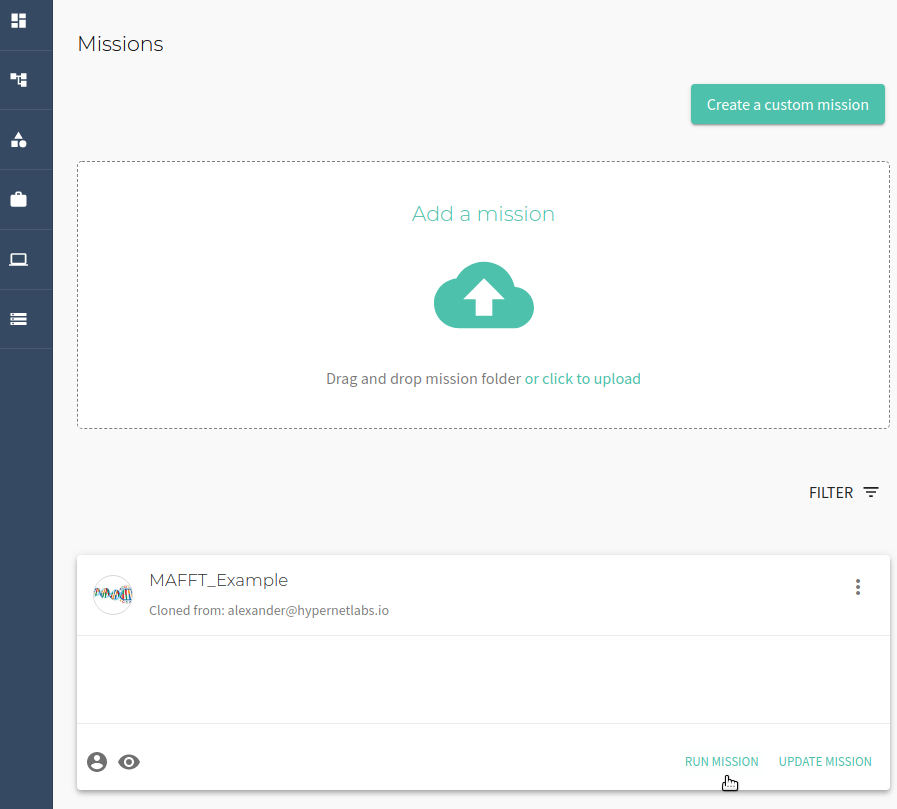
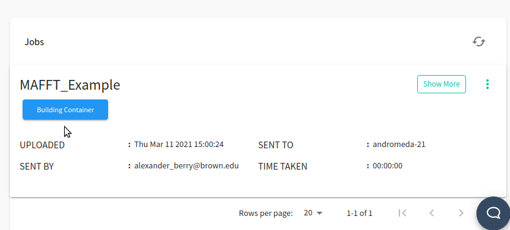
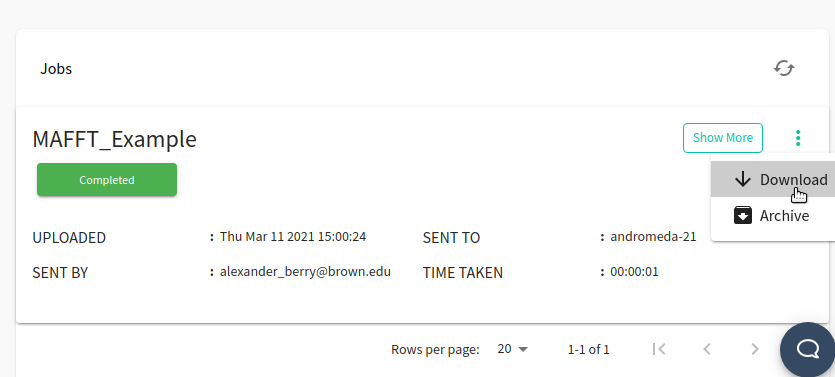

# Tutorial: Running Autodock Vina in Galileo

### Getting started with Autodock in Galileo

To get started with Galileo, [log into your account](http://galileo.hypernetlabs.io/) using Firefox or Chrome.

### Understanding the user interface and cloning a Mission

To run the AutoDock Vina Example, start by navigating to the Missions tab using the side menu. Clone the AutoDock_Vina_Example Mission from the Explore Missions tab. Use the filter to search for the mission by name and click "Apply".

Once you have found the correct Mission, click "View Mission".

To clone the public Mission to your account, click the "Clone" button in the upper right corner of the interface.

You will now see a cloned copy of the Mission in your Missions.

### Running a job and collecting results

Now we are ready to run a job using the Mission. Click the **Run** button in the upper right corner of the Mission tab. You will see a "Mission run successfully!" message. At the bottom of the Mission tab, you can track the progress of the job.

Once the computation is completed, the job will shut down and collect the results. Once the job progress reads "Completed", you can download the results by opening the three-dot menu and clicking **Download**.

### Contact us

We hope this tutorial was helpful. Please let us know if you have any questions or any problems using Galileo. Your feedback is extremely important to us. Contact the team any time by tagging (@HypernetLabs) on our [forum](galileo-forum.hypernetlabs.io).
