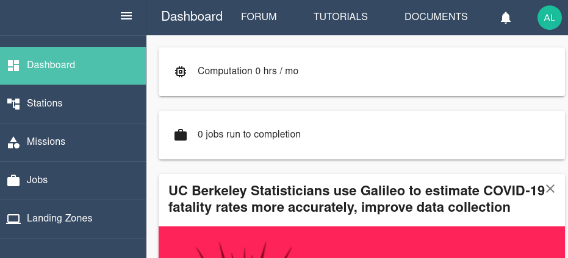
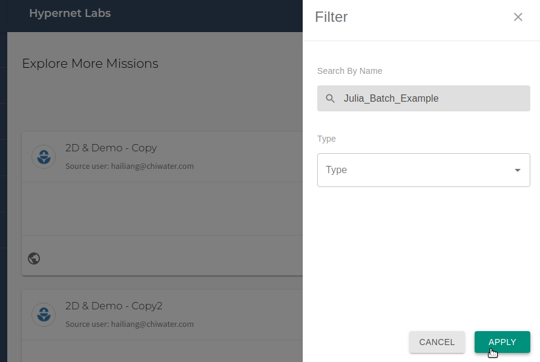
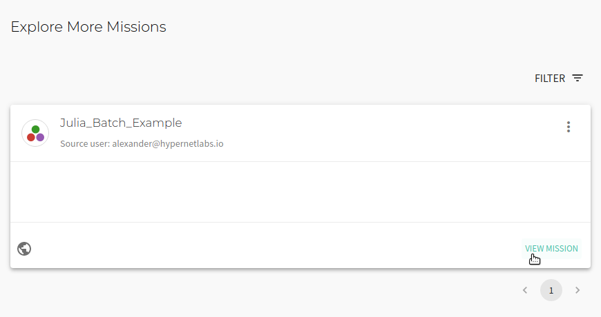
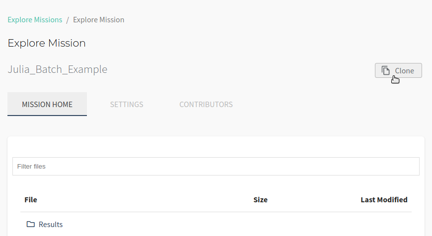
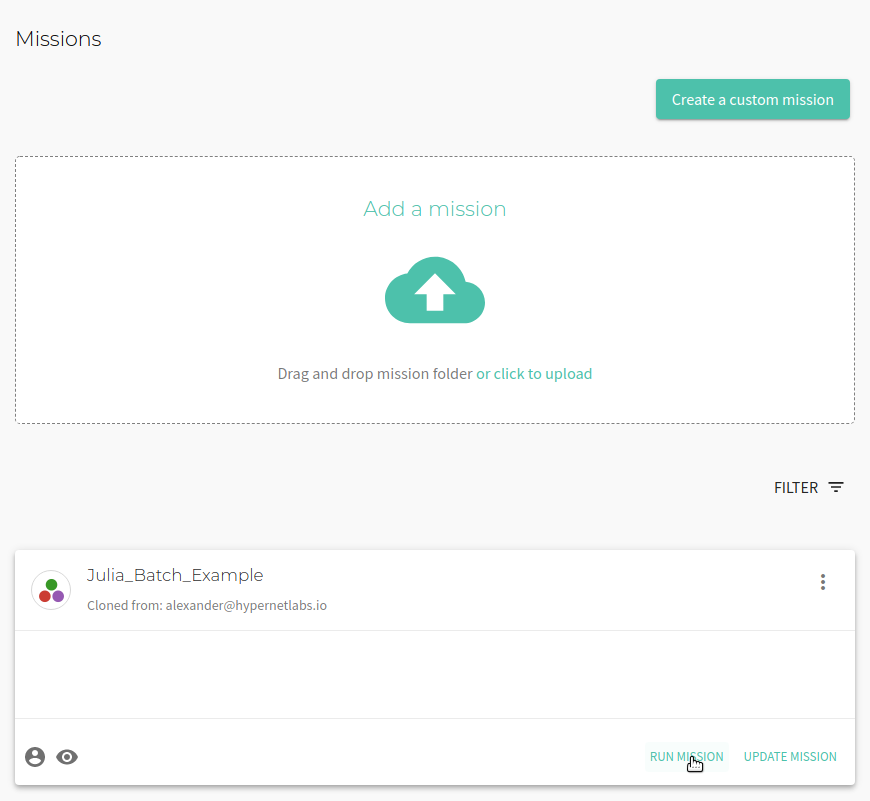
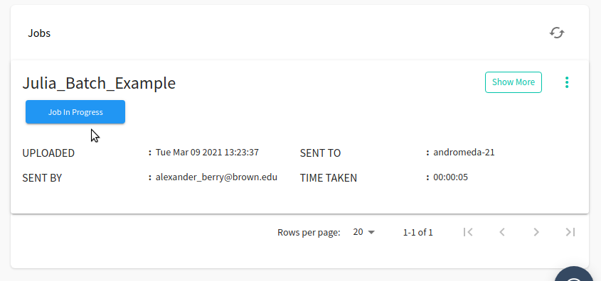
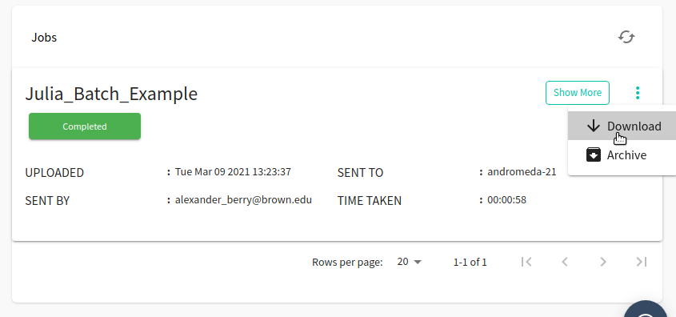
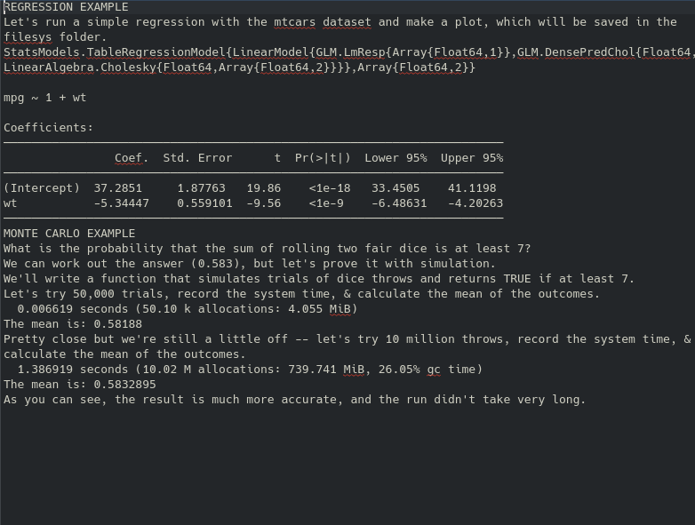

# Tutorial: Running Julia in Galileo

### Gettting started with Julia in Galileo

To get started with Galileo, [log into your account](http://galileo.hypernetlabs.io/) using Firefox or Chrome.

### Understanding the user interface and cloning a Mission

When you log into Galileo, the first thing you’ll see is your Dashboard:

To run the Julia example, start by navigating to the Missions tab using the side menu. Clone the Julia Batch example Mission from the Explore Missions tab. Use the filter to search for the mission by name and click "Apply".

Once you have found the correct Mission, click "View Mission".

To clone the public Mission to your account, click the "Clone" button in the upper right corner of the interface. Choose between creating a public or private clone and also choose which Cargo Bay to use.

You will now see a cloned copy of the Mission in your Missions.

### Let's take a look at our files

The julia_example.jl script conducts a simple linear regression using the supplied mtcars.csv dataset and makes a simple plot. It also demonstrates how to use a dataset loaded from a library.

Next, our julia_example.jl file conducts a Monte Carlo experiment that simulates 50,000 throws of two six-sided dice to calculate the probability that the sum of one throw of two dice is greater than or equal to seven. It then repeats the same experiment 10 million times. Finally it compares the means of the two samples and the amount of time it took to calculate them.

### Running a job and collecting results

Now we are ready to run a job using the Mission. Click the **Run** button in the upper right corner of the Mission tab. You will see a "Mission run successfully!" message. At the bottom of the Mission tab, you can track the progress of the job.

Once the computation is completed, the job will shut down and collect the results. Once the job progress reads "Completed", you can download the results by opening the three-dot menu and clicking **Download**.

Let's take a look at the the output.log file first, which returns the results of the regression and simulation:

### Contact us

We hope this tutorial was helpful. Please let us know if you have any questions or any problems using Galileo. Your feedback is extremely important to us. Contact us anytime at [matthew@hypernetlabs.io](matthew@hypernetlabs.io) or [alexander@hypernetlabs.io](alexander@hypernetlabs.io).