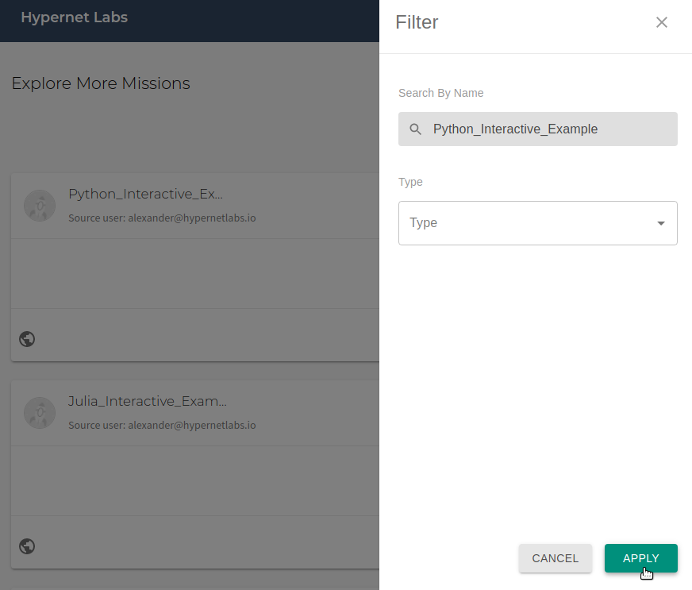
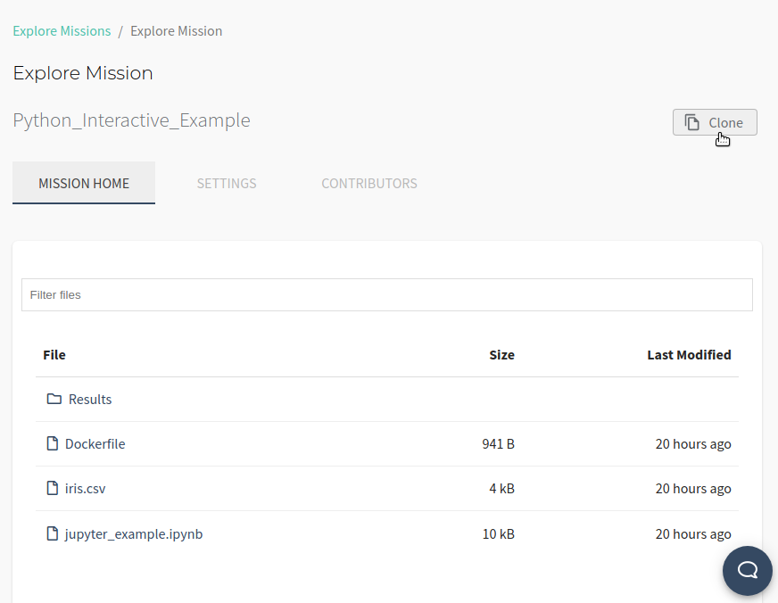
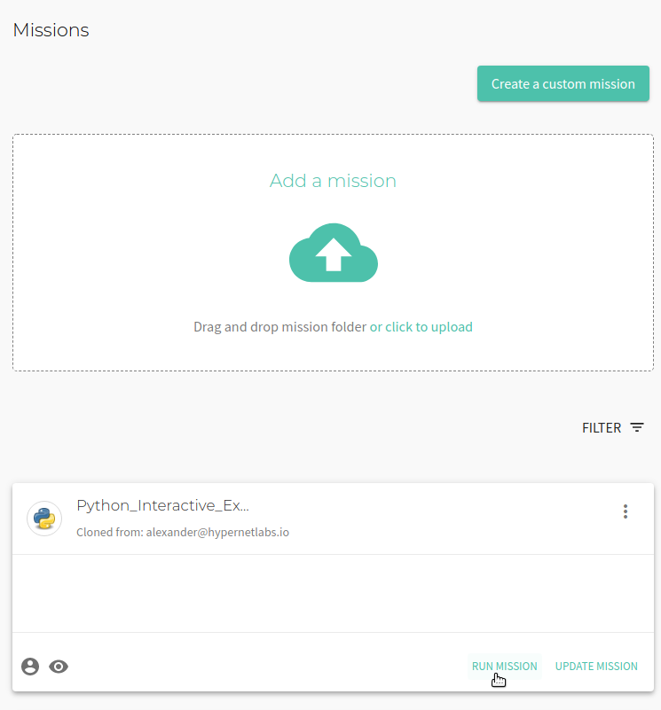
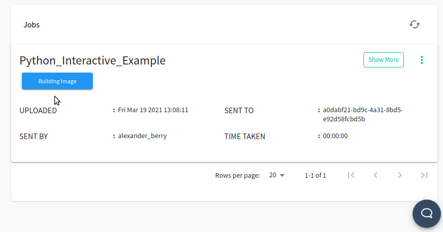
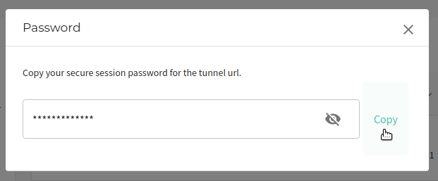
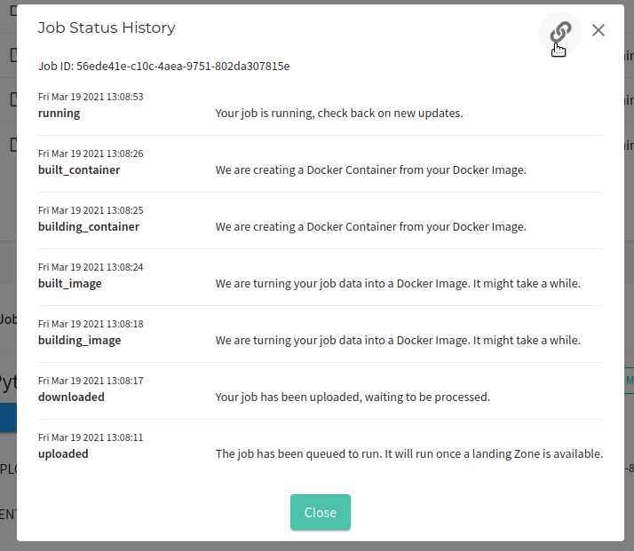
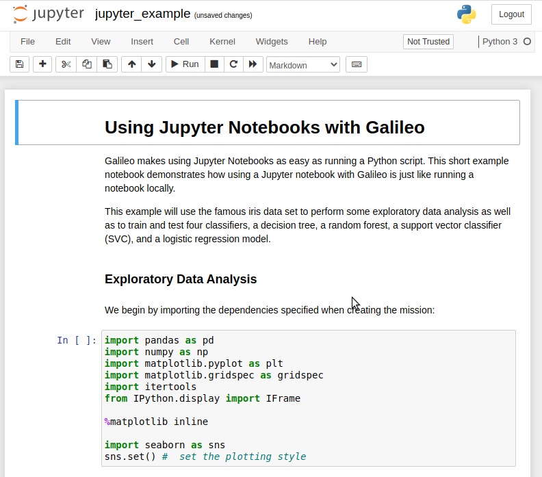
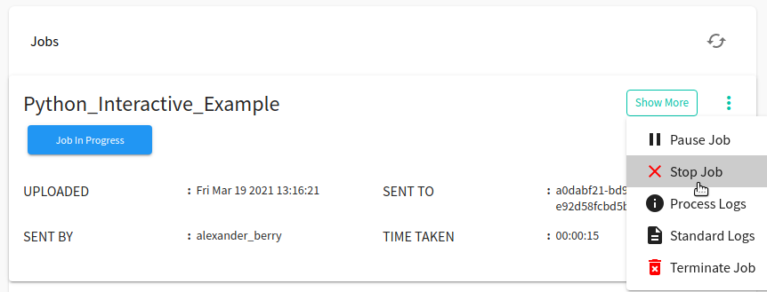
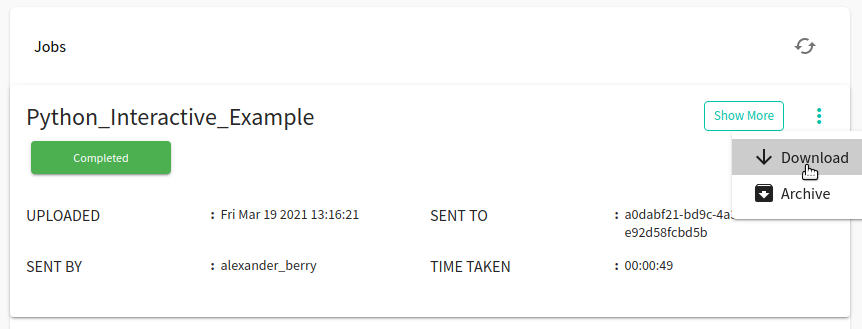

# Tutorial: Running Interactive Python in Galileo

### Gettting started with Python in Galileo

To get started with Galileo, [log into your account](http://galileo.hypernetlabs.io/) using Firefox or Chrome.

### Understanding the user interface and cloning a Mission

When you log into Galileo, the first thing you’ll see is your Dashboard:

To run the Python interactive example, start by navigating to the Missions tab using the side menu. Clone the Python interactive example Mission from the Explore Missions tab. Use the filter to search for the mission by name and click "Apply".

Once you have found the correct Mission, click "View Mission".

To clone the public Mission to your account, click the "Clone" button in the upper right corner of the interface. Choose between creating a public or private clone and also choose which Cargo Bay to use.

You will now see a cloned copy of the Mission in your Missions.

### Let's take a look at our files

The jupyter_example.ipynb conducts some exploratory data analysis and visualizes the decision boundaries of various machine learning algorithms using the supplied iris.csv data set. It also demonstrates how to use data sets loaded from an online source or from a library.

### Running a job and collecting results

Now we are ready to run a job using the Mission. Click the **Run** button in the upper right corner of the Mission tab. You will see a "Mission run successfully!" message. At the bottom of the Mission tab, you can track the progress of the job.

Once the job's status is "Job In Progress", you are ready to open Jupyter. First, copy the automatically-generated tunnel password for the Mission by clicking on the key icon. Copy the password to your clipboard:

Now, click **Job In Progress** and then click the chain icon to open the tunnel URL.

Paste the password and click **Log in**.

You are now using Jupyter in Galileo and you have immediate access to the files you uploaded as part of the Mission.

Once you have finished working in Jupyter, navigate back to the Mission tab and open the three-dot menu in the Jobs progress panel. Stop the job by clicking **Stop Job**.

The job will shut down and collect the results. Once the job progress reads "Completed", you can download any files generated by the Jupyter job by opening the three-dot menu again and clicking **Download**.

### Contact us

We hope this tutorial was helpful. Please let us know if you have any questions or any problems using Galileo. Your feedback is extremely important to us. Contact us anytime at [matthew@hypernetlabs.io](matthew@hypernetlabs.io) or [alexander@hypernetlabs.io](alexander@hypernetlabs.io).