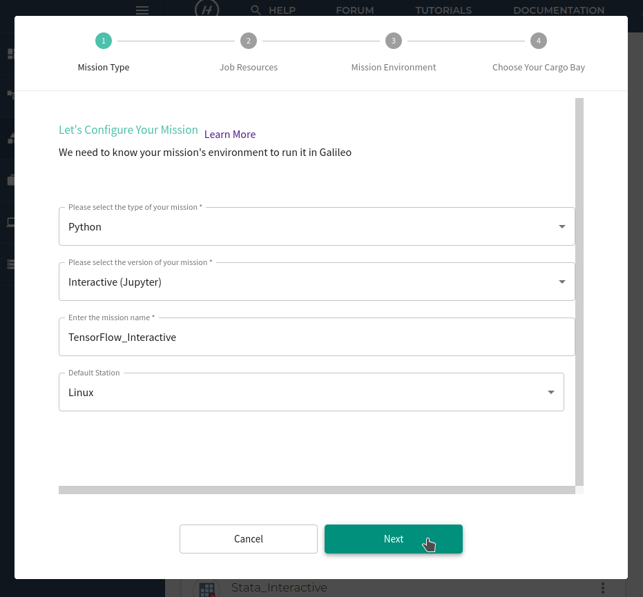
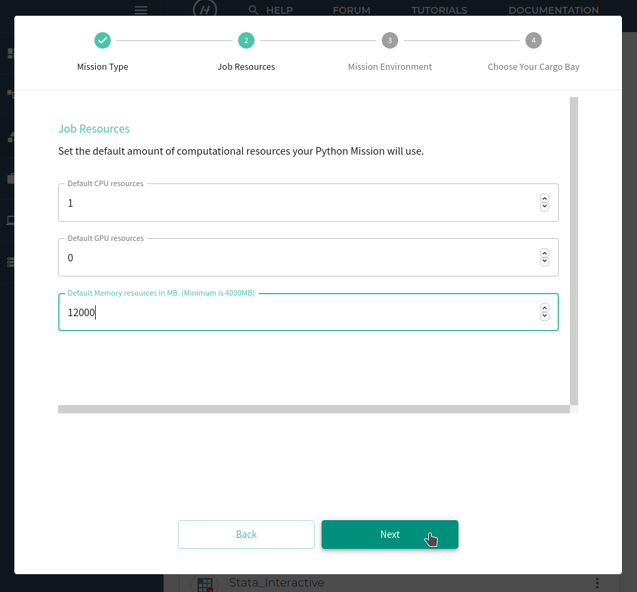
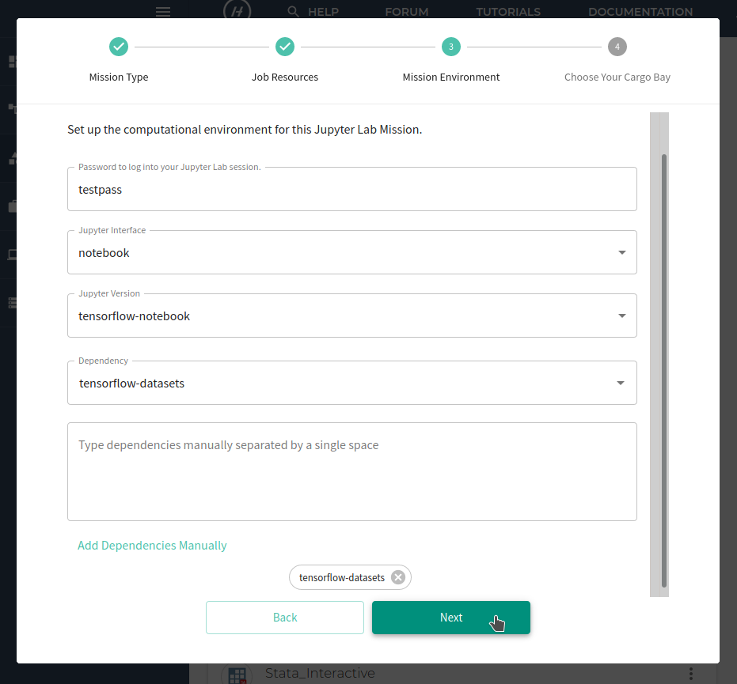
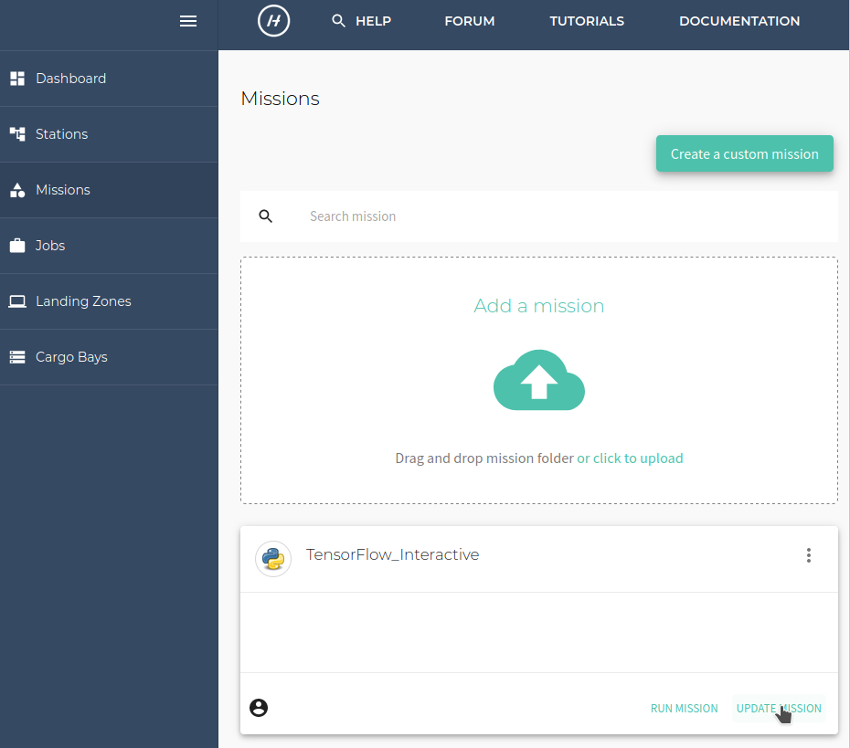
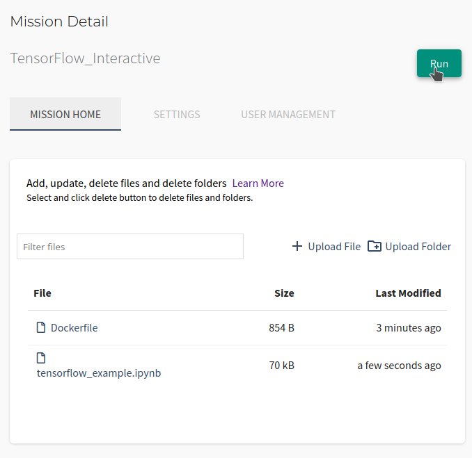
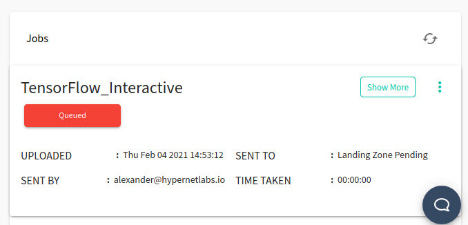
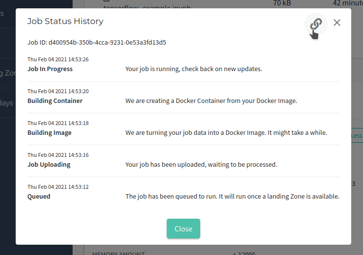
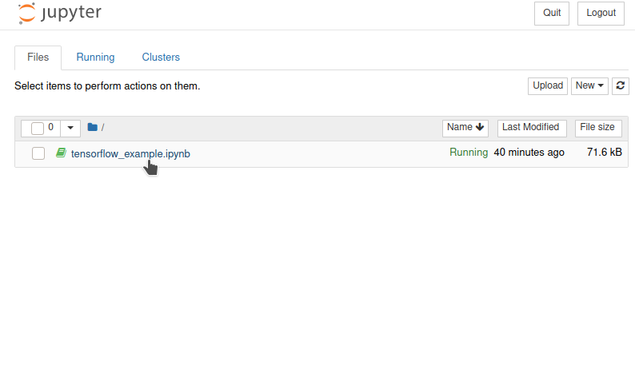
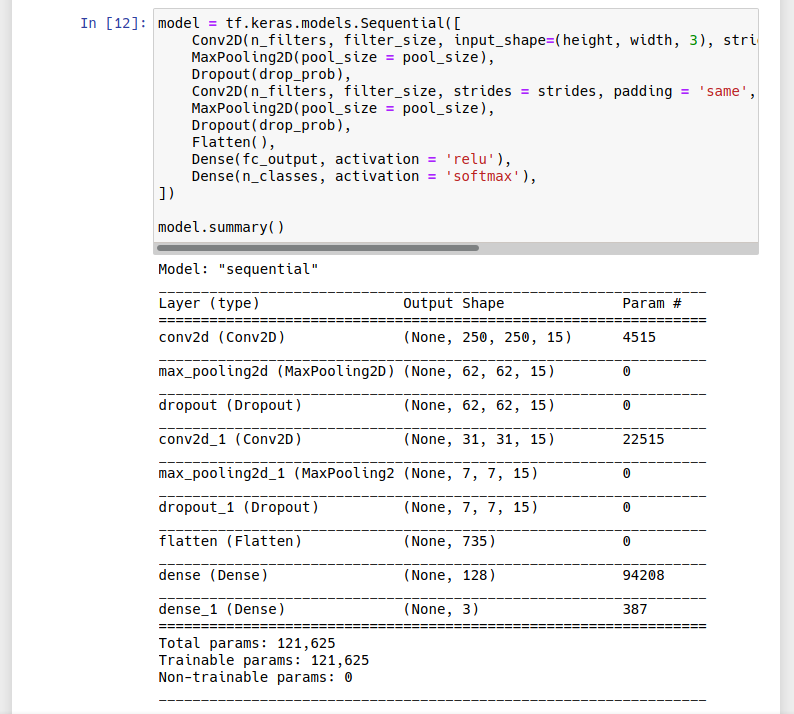
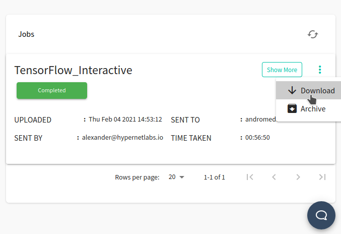

# Tutorial: Running TensorFlow in Galileo

### Gettting started with TensorFlow in Galileo

To get started with Galileo, [log into your account](http://galileo.hypernetlabs.io/) using Firefox or Chrome and download our TensorFlow example file [from GitHub](https://github.com/GoHypernet/Galileo-examples/archive/tensorflow.zip). The downloaded file is a .ipynb file.

### Let's take a look at our files

The tensorflow_example.ipynb trains a convolutional neural network to classify images of plant disease from the [Makerere bean data set](https://github.com/AI-Lab-Makerere/ibean/). This example is adapted from the [Object classification in TensorFlow tutorial](https://meritocracy.is/blog/2020/06/24/object-classification-in-tensorflow/) at meritocracy.is.

### Understanding the user interface and creating a Mission

When you log into Galileo, the first thing you’ll see is your Dashboard:

To run the Jupyter notebook, start by navigating to the Missions tab using the side menu. On the Missions tab, click the **Creat a custom mission** button.

Configure the mission by selecting the mission type. Choose **Python** and then select the version. This tutorial will use **Interactive (Jupyter)**.

Next, give the mission a name and assign it to a default station to use. This tutorial will use the **Linux** station. Click **Next**.

Set the default amount of computational resources for the mission. Choose the CPU resources, GPU resources, and memory resources. For this tutorial, at least 12000 MB of memory is recommended. Click **Next**.

Create the mission environment by choosing a password to access the Jupyter session. You can install any dependencies either by selecting them from the drop-down menu of popular repositories or by entering the packages' names manually. For this tutorial, make sure to choose the `tensorflow-notebook` version of Jupyter and add the `tensorflow-datasets` dependency. Click **Next**.

Finally, select the Cargo Bay you will use for this Mission. You can choose from the default Hypernet storage or an external storage provider. Galileo works seemlessly with cloud storage platforms such as Dropbox and Storj. Find out more about using these platforms [here](https://galileo-sdk.readthedocs.io/en/latest/cargobays.html). Click **Submit**.

The Mission has now been created!

### Running a job and collecting results

You will now see the new Mission reflected in the Mission tab. Click **Update Mission** to add and edit the Mission's files.

Upload the .ipynb file by clicking the **Upload File** button. You will see the files in the Mission interface.

Now we are ready to run a job using the Mission. Click the **Run** button in the upper right corner of the Mission tab. You will see a "Mission run successfully!" message. At the bottom of the Mission tab, you can track the progress of the job.

Once the job's status is "Job In Progress", you are ready to open Jupyter. Click **Job In Progress** and then click the tunnel URL.

Enter the Mission password you set previously. Click **Log in**.

You are now using Jupyter in Galileo and you have immediate access to the files you uploaded as part of the Mission.

### Using TensorFlow

The TensorFlow example in the notebook builds and trains a neural network to identify visible signs of disease in bean plants.

To shorten the training time for demonstration purposes, the notebook only trains the model for five epochs. *For the model to achieve higher accuracy, train it for more epochs and upgrade your Galileo account to have GPU capabilities to supercharge your productivity. Click [here](https://hypernetlabs.io/galileo/) to learn more about how Galileo can simplify your workflow.*

Once you have finished working in Jupyter, navigate back to the Mission tab and open the three-dot menu in the Jobs progress panel. Stop the job by clicking **Stop Job**.

The job will shut down and collect the results. Once the job progress reads "Completed", you can download any files generated by the Juypter job by opening the three-dot menu again and clicking **Download**.

### Contact us

We hope this tutorial was helpful. Please let us know if you have any questions or any problems using Galileo. Your feedback is extremely important to us. Contact us anytime at [matthew@hypernetlabs.io](matthew@hypernetlabs.io) or [alexander@hypernetlabs.io](alexander@hypernetlabs.io).