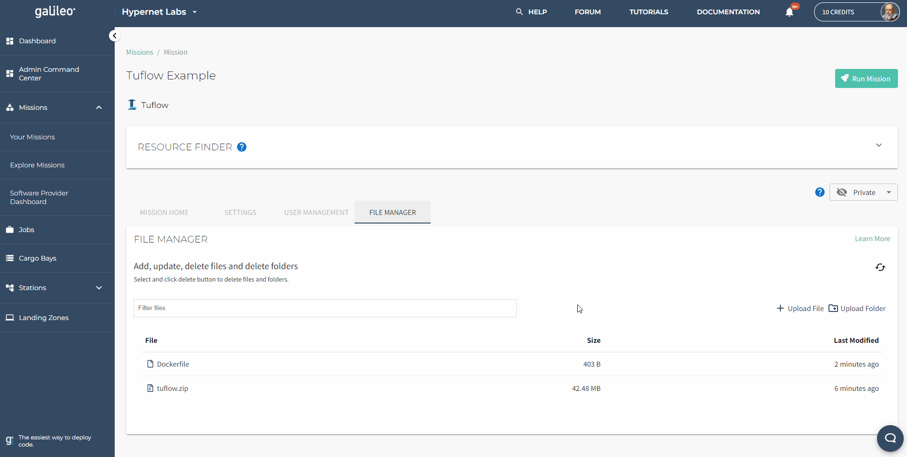
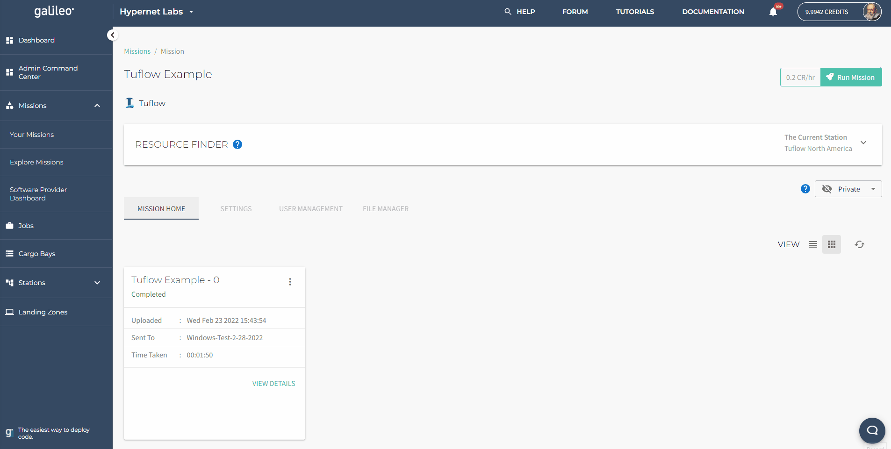

# Tutorial: Running Tuflow in Galileo

## Getting Started

Galileo is a hybrid-decentralized cloud platform that uses object storage to relay your model files from your local machine to
a target machine that will run your Tuflow model for you. Since every file requires its own upload call, uploading a Tuflow
model folder could take a very long time because models can typically contain hundreds of small files. Therefore, to run Tuflow
models in Galileo, you must first compress it into a zip folder (which will automatically be decompressed by Galileo at runtime). 

Next, log into [Galileo](https://galileo.hypernetlabs.io) and set up a new Tuflow Mission. You must select the version of
Tuflow you wish to run, set the name of the .bat script that will start you analysis, the directory the .bat script can 
be found in after the zip file is decompressed, and the IP address or URL of your Tuflow license server. 

The default license server address is set to 10.0.0.3 which is a subnet address of Hypernet Labs' licensing server that 
is only accessible on Windows VM resources supplied by Hypernet Labs. You can configure the license address to point at 
your own license server if it has a publicly reachable IP address or URL or if you are running your own Galileo Landing 
Zone on your own hardware resources.

Upload your zipped model into the Mission's file manager. If you need to make a change to your model, you must change it on 
your local machine, rezip, then upload it again into the Mission's file manager tab.

Search for a Station to run on using the Mission Resource Finder. This tool will also display the price in credits per hour
to run on the hardware provided by that station. You can check on the progress of you job once it is in the running state by 
querying the process information and standard out. 

Once your job is finished, you can download the results from that run from anywhere with a suitable internet connection and
examine the results.

## Cloning an example

If you don't have a model to start with, you can clone 
[this one](https://galileo.hypernetlabs.io/public-missions/d0a8db52-fb79-42f7-8060-d329feecd349) to you account and run it 
for free without a license.

## Tuflow as a Container

Check out Hypernet Labs' containerization of the Tuflow classic simulator software 
[here](https://github.com/GoHypernet/Galileo-Tuflow-Framework). 

### Contact us

We hope this tutorial was helpful. Please let us know if you have any questions or any problems using Galileo. Your 
feedback is extremely important to us. Contact the team any time by tagging (@HypernetLabs) on our 
[forum](https://galileo-forum.hypernetlabs.io).
