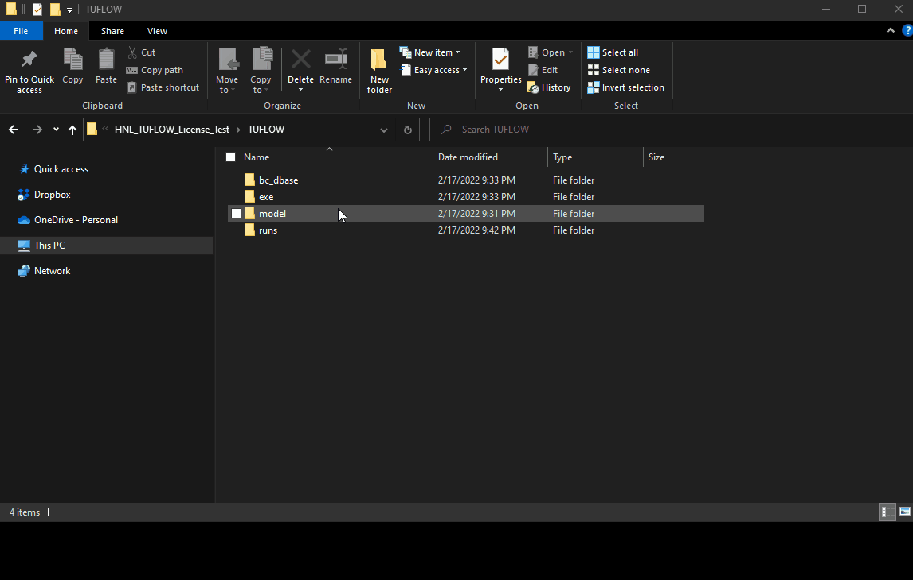
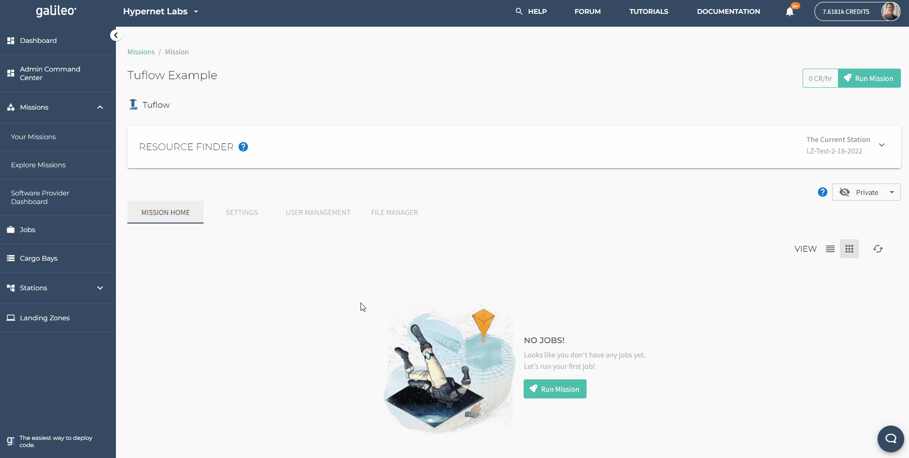

# Tutorial: Running Tuflow in Galileo

## Getting Started

Galileo is a hybrid-decentralized cloud platform that uses object storage to relay your model files from your local machine to 
target machine that will run your Tuflow model for you. Since every file requires its own upload call, uploading a Tuflow model
folder could take a very long time since models can typically contain hundreds of small files. Therefore, to run tuflow models 
in Galileo, you must first compress your model into a zip folder (which will automatically be decompressed by Galileo at 
runtime. 

Next, log into [Galileo](galileo.hypernetlabs.io) and set up a new Tuflow Mission. 

Upload your zipped model into the Mission's file manager.

Select a Galileo Station to run on. 

### Contact us

We hope this tutorial was helpful. Please let us know if you have any questions or any problems using Galileo. Your feedback is extremely important to us. Contact the team any time by tagging (@HypernetLabs) on our [forum](https://galileo-forum.hypernetlabs.io).
