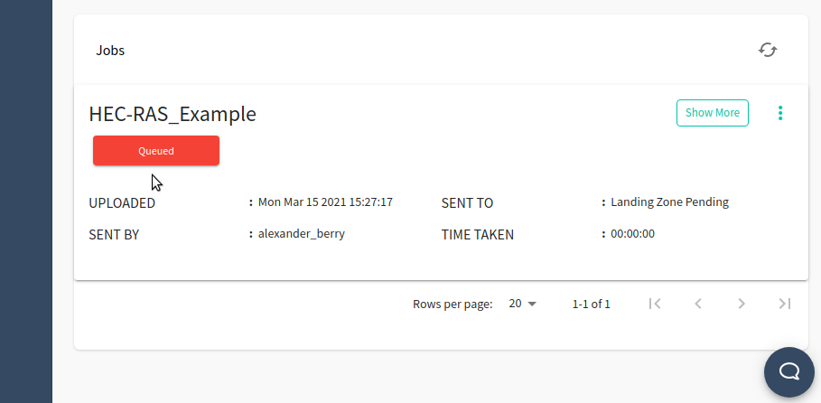

# Tutorial: Running HEC-RAS in Galileo

### Gettting started with HEC-RAS in Galileo

To get started with Galileo, [log into your account](http://galileo.hypernetlabs.io/) using Firefox or Chrome.

### Understanding the user interface and cloning a Mission

When you log into Galileo, the first thing you’ll see is your Dashboard:

To run the HEC-RAS example, start by navigating to the Missions tab using the side menu. Clone the HEC-RAS example Mission from the Explore Missions tab. Use the filter to search for the mission by name and click "Apply".

Once you have found the correct Mission, click "View Mission".

To clone the public Mission to your account, click the "Clone" button in the upper right corner of the interface. Choose between creating a public or private clone and also choose which Cargo Bay to use.

You will now see a cloned copy of the Mission in your Missions.

### Let's take a look at our files

HEC-RAS is software that models the hydraulics of water flow through natural rivers and other channels. The HEC-RAS example in this tutorial is the standard 2D Muncie example that comes with the examples package of the HEC-RAS simulator.

### Running a job and collecting results

Now we are ready to run a job using the Mission. Click the **Run** button in the upper right corner of the Mission tab. You will see a "Mission run successfully!" message. At the bottom of the Mission tab, you can track the progress of the job.

Once the computation is completed, the job will shut down and collect the results. Once the job progress reads "Completed", you can download the results by opening the three-dot menu and clicking **Download**.

### Contact us

We hope this tutorial was helpful. Please let us know if you have any questions or any problems using Galileo. Your feedback is extremely important to us. Contact us anytime at [matthew@hypernetlabs.io](matthew@hypernetlabs.io) or [alexander@hypernetlabs.io](alexander@hypernetlabs.io).