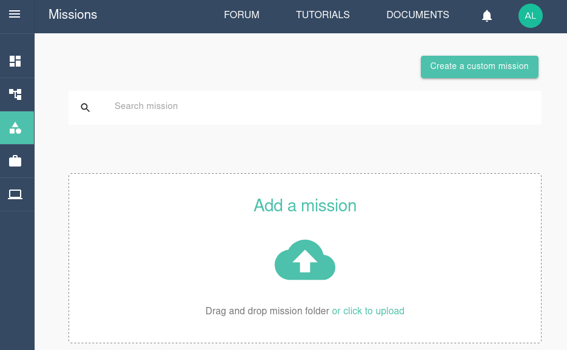

# Tutorial: Running R in Galileo

### Gettting started with R in Galileo

To get started with Galileo, [log into your account](http://galileo.hypernetlabs.io/) using Firefox or Chrome and download our R example file [from GitHub](https://github.com/GoHypernet/Galileo-examples/archive/R.zip). The downloaded file consists of a .r file and a .csv file.

### Let's take a look at our files

The rMonteCarlo.R script conducts a linear regression, makes a simple plot, and then runs two Monte Carlo simulations.

The first Monte Carlo simulates tossing two dice and calculates the number of rolls that are 7 or less. The second Monte Carlo increases the number of iterations and runs the simulation in parallel.

### Understanding the user interface and creating a Mission

When you log into Galileo, the first thing you’ll see is your Dashboard:

To run the rExample, start by navigating to the Missions tab using the side menu. On the Missions tab, click the **Creat a custom mission** button.

Configure the mission by selecting the mission type. Choose **R Language** and then select the version: **Batch Mode**, **Interactive (Jupyter)**, or **Interactive (R Studio)**. This tutorial will use RStudio.

Next, give the mission a name and assign it to a default station to use. This tutorial will use the **Linux** station. Click **Next**.

Set the default amount of computational resources for the mission. Choose the CPU resources, GPU resources, and memory resources. Click **Next**.

Create the mission environment by choosing a username and password to access the RStudio session. You can also install any CRAN or Bioconductor repositories either by selecting them from the drop-down menu of popular repositories or by entering the packages' names manually. Click **Next**.

Finally, select the Cargo Bay you will use for this Mission. You can choose from the default Hypernet storage or an external storage provider. Galileo works seemlessly with cloud storage platforms such as Dropbox and Storj. Find out more about using these platforms [here](https://galileo-sdk.readthedocs.io/en/latest/cargobays.html). Click **Submit**.

The Mission has now been created!

### Running a job and collecting results

You will now see the new Mission reflected in the Mission tab. Click **Update Mission** to add and edit the Mission's files.

Upload the .r and .csv example files by clicking the **Upload File** button. You will see the files in the Mission interface.

It is possible to edit text files directly in the Mission tab by using the Mission text editor. Find out more about the editor by clicking [here to visit the Galileo forum](https://galileo-forum.hypernetlabs.io/t/mission-text-editor-walkthrough/68).

Now we are ready to run a job using the Mission. Click the **Run** button in the upper right corner of the Mission tab. You will see a "Mission run successfully!" message. At the bottom of the Mission tab, you can track the progress of the job.

Once the job's status is "Job In Progress", you are ready to open RStudio. Click **Job In Progress** and then click the tunnel URL.

Enter the Mission user name and password you set previously. You will then see the noVNC prompt. Click **Connect**.

You are now using RStudio in Galileo! It works just like RStudio on your desktop, and you have immediate access to the files you uploaded as part of the Mission.

Once you have finished working in RStudio, navigate back to the Mission tab and open the three-dot menu in the Jobs progress panel. Stop the job by clicking **Stop Job**.

The job will shut down and collect the results. Once the job progress reads "Completed", you can download any files generated by the R job by opening the three-dot menu again and clicking **Download**.

### Contact us

We hope this tutorial was helpful. Please let us know if you have any questions or any problems using Galileo. Your feedback is extremely important to us. Contact us anytime at [matthew@hypernetlabs.io](matthew@hypernetlabs.io) or [alexander@hypernetlabs.io](alexander@hypernetlabs.io).